# Hooks

Eternal Stack hooks are shell and Python scripts that Claude Code invokes at fixed lifecycle points. They record session evidence, route prompts to the right skills, preserve state across compaction, and — when strict mode is enabled — block unsafe tool use and unverified completion claims.

Skills describe repeatable workflows. Hooks enforce what must not be skipped at tool boundaries. Together they keep agent behavior aligned with install source without relying on the model to remember every rule.

## Documentation map

| Doc | Audience | Contents |
| --- | --- | --- |
| This file | Everyone | Hook catalog, lifecycle wiring, libraries, testing |
| [guards.md](guards.md) | Strict-mode operators | Pretool deny rules, stop-verifier gates, fail-open matrix |
| [compact-recovery.md](compact-recovery.md) | Compact debugging | `etrnl-state.mjs` commands, staged rehearsal |
| [configuration.md](configuration.md) | Tuning | Env vars for guards, rate limiter, state, Hindsight |

## Concepts

**Observer hooks** watch tool and session activity, append structured events to session state, and inject context. They do not deny tool calls except where noted below.

**Enforcement hooks** return a block decision to Claude Code. Most enforcement hooks register only when you install with `ETRNL_ENABLE_STRICT=1`. Two exceptions run on every install:

- **`cc-stop-verifier.sh`** blocks completion claims that lack evidence (registered on `Stop` in both default and strict templates).
- **`cc-rtk-rg-compat.sh`** rewrites selected `rg` Bash commands before RTK hooks run (registered on `PreToolUse` for `Bash` in both templates).

**Session state** lives in a per-session JSON file under the system temp directory (`CLAUDE_GUARD_STATE_DIR` overrides the root). Durable cross-compact history is appended to canonical ETRNL JSONL state via `scripts/etrnl-state.mjs` (`ETRNL_STATE_DIR` overrides storage for tests).

**Installed copies** land at `~/.claude/hooks/`. The installer also copies `docs/` to `~/.claude/docs/` so the same references are available from an install.

## Lifecycle overview

```mermaid
flowchart TB
  subgraph session [Session]
    SS[SessionStart]
    UP[UserPromptSubmit]
    UPE[UserPromptExpansion]
    SE[SessionEnd]
  end
  subgraph tools [Tools]
    PT[PreToolUse]
    PU[PostToolUse]
    PUF[PostToolUseFailure]
    PB[PostToolBatch]
  end
  subgraph compact [Compaction]
    PCpre[PreCompact]
    PCpost[PostCompact]
  end
  subgraph finish [Completion]
    ST[Stop]
    SAS[SubagentStop]
  end
  SS --> cc-sessionstart-restore
  UP --> cc-userprompt-router
  UPE --> cc-userprompt-expansion
  PT --> cc-rtk-rg-compat
  PT --> cc-pretooluse-guard
  PU --> cc-rate-limiter
  PU --> cc-posttooluse-sycophancy
  PU --> cc-posttooluse-quality
  PUF --> cc-posttoolusefailure-diagnose
  PB --> cc-posttoolbatch-observer
  PCpre --> cc-precompact-save
  PCpost --> cc-postcompact-record
  ST --> cc-stop-verifier
  SAS --> cc-subagentstop-record
  SE --> cc-sessionend-save
```



Solid boxes are Claude Code events. Hook names are the `cc-*` entrypoints wired in `templates/settings.json` (default) or `templates/settings.strict.json` (strict).

## Install profiles

Install selects the settings template:

| Template | Command | Pretool guard | Post-write blockers | Stop verifier |
| --- | --- | --- | --- | --- |
| Default | `./scripts/install.sh` | RTK `rg` compat only | Rate limiter (advisory) | Yes |
| Strict | `ETRNL_ENABLE_STRICT=1 ./scripts/install.sh` | Full pretool guard | Sycophancy + quality + failure diagnose | Yes |

Strict mode adds `cc-pretooluse-guard.sh` on `PreToolUse`, post-write quality and sycophancy checks on `PostToolUse`, `cc-posttoolusefailure-diagnose.sh` on `PostToolUseFailure`, and `cc-subagentstop-record.sh` on `SubagentStop`. Compact and session hooks are identical between templates.

Run `./scripts/doctor.sh` and `tests/test-hooks.sh` before enabling strict mode. Use [install.md](install.md) for rollback and `--preserve-settings`.

## Hook catalog

Every hook entrypoint under `hooks/` is listed below. Matchers and timeouts come from the installed settings template.

| Hook | Event | Matcher | Default | Strict | Blocks? | Purpose |
| --- | --- | --- | --- | --- | --- | --- |
| `cc-sessionstart-restore.sh` | `SessionStart` | — | Yes | Yes | No | Restore compact handoff, drift/update hints, optional learning hints |
| `cc-userprompt-router.sh` | `UserPromptSubmit` | — | Yes | Yes | No | Record requested skills, reinject `CLAUDE.md`, route `etrnl-*` hints |
| `cc-userprompt-expansion.sh` | `UserPromptExpansion` | — | Yes | Yes | No | Expand in-root `@*.md` imports for prompt context |
| `cc-rtk-rg-compat.sh` | `PreToolUse` | `Bash` | Yes | Yes | Rewrites | Proxy `rg` flags RTK mishandles to `rtk proxy --ultra-compact` |
| `cc-pretooluse-guard.sh` | `PreToolUse` | `Bash\|Read\|Edit\|Write\|MultiEdit\|WebSearch\|Task\|TaskCreate\|Agent\|mcp__serena__search_for_pattern` | No | Yes | Yes | Policy denies before tools run (see [guards.md](guards.md)) |
| `cc-rate-limiter.sh` | `PostToolUse` | — | Yes | Yes | No | Advisory warnings for rapid tool use and repeated failures |
| `cc-posttooluse-sycophancy.sh` | `PostToolUse` | — | No | Yes | Yes | Block agreement-without-evidence in assistant text after tools |
| `cc-posttooluse-quality.sh` | `PostToolUse` | — | No | Yes | Yes | Block complexity/test-quality regressions on edited files |
| `cc-posttoolusefailure-diagnose.sh` | `PostToolUseFailure` | — | No | Yes | Yes | Record failures; block repeated identical failures |
| `cc-posttoolbatch-observer.sh` | `PostToolBatch` | — | Yes | Yes | No | Record reads, edits, verification runs, skills, bug-memory notes |
| `cc-stop-verifier.sh` | `Stop` | — | Yes | Yes | Yes | Block unverified completion claims and evidence-discipline violations |
| `cc-subagentstop-record.sh` | `SubagentStop` | — | No | Yes | Yes | Record subagent output into execution ledger; block malformed output |
| `cc-precompact-save.sh` | `PreCompact` | — | Yes | Yes | No | Append `compact_pre` event; snapshot session counters |
| `cc-postcompact-record.sh` | `PostCompact` | — | Yes | Yes | No | Append `compact_post`; mark verification stale after compact |
| `cc-sessionend-save.sh` | `SessionEnd` | — | Yes (async) | Yes (async) | No | Append session-end event; remove ephemeral session state file |
| `cc-hindsight-lesson.py` | — | — | Invoked | Invoked | No | Background lesson retain to ETRNL state and optional Hindsight API |

### `cc-sessionstart-restore.sh`

Runs synchronously at session start (timeout 15–20s depending on template).

- **`source=compact`**: Injects only the bounded compact-handoff packet from `etrnl-state.mjs` plus a short skill hint. Does not run update or workflow projections on this path.
- **Normal start**: May run `update-check.mjs` (drift, optional auto-update), workflow-health hints when issues exist, and project learning hints when enabled.
- Updates session `cwd` and git branch/dirty metadata when inside a git work tree.

Fail-open: missing `jq`, invalid JSON, or update-check failures skip injection rather than blocking the session.

### `cc-userprompt-router.sh`

Runs on every user prompt before the model sees it.

- Detects `/etrnl-*` and related slash commands; records `requestedSkills` in session state.
- Reinjects global `~/.claude/CLAUDE.md` and project `CLAUDE.md` / `AGENTS.md` hierarchy once per session (tunable via `ETRNL_INJECT_CLAUDE_MD`).
- Applies keyword routing hints for bundled backend-pattern workflows.
- When `update-check.mjs` reports stale repo-owned skills or tool stack, may inject a short confirmation before honoring a requested `etrnl-*` skill.

Fail-open: skips context injection on parse or state errors.

### `cc-userprompt-expansion.sh`

Expands `@path/to/file.md` references inside injected startup markdown. Only follows references that stay inside the global Claude root or the importing project tree (max five hops). Keeps expansion logic separate from routing so each hook stays testable in isolation.

### `cc-rtk-rg-compat.sh`

Runs before native RTK `PreToolUse` hooks and before `cc-pretooluse-guard.sh` when strict mode is on (`merge-settings.mjs` enforces ordering).

When `rtk` and `jq` are available, detects direct `rg` invocations that use flags or modes `rtk grep` does not preserve (`--json`, globs, `-l`, chained shell, and similar). Returns `updatedInput` so Claude runs `rtk proxy --ultra-compact rg …` instead. No-op when the command is already safe or RTK is absent.

See [troubleshooting.md](troubleshooting.md) if RTK and native `rg` behavior diverge after upgrades.

### `cc-pretooluse-guard.sh`

Strict-mode pretool gate. Classifies the incoming tool, applies hard denies for safety-critical patterns, then repeat/evidence checks. Documented rule families live in [guards.md](guards.md).

Notable behaviors:

- Bash: destructive commands, output limiter pipes, unbounded inventory dumps, dev servers without `port-guard.mjs` ports, disk-cleanup scope when `etrnl-ops-disk-cleanup` is active.
- Read/Edit/Write: directory reads, blind edits, file sprawl when `CLAUDE_GUARD_FILE_SPRAWL=1`, reuse-search requirements for new source files.
- WebSearch / Serena / Task: stale search canary, scoped pattern search, subagent packet requirements.

Fail-closed when strict hooks are enabled and internal guard logic errors occur.

### `cc-rate-limiter.sh`

Advisory only — never blocks tool use. Tracks per-session tool cadence and failure streaks in a locked file under `ETRNL_RATE_LIMITER_DIR`. Emits stderr warnings when thresholds are exceeded (`ETRNL_RATE_LIMITER_*` env vars).

Disable with `ETRNL_RATE_LIMITER=0` or `CLAUDE_GUARD_DISABLED=1`.

### `cc-posttoolbatch-observer.sh`

Runs after each tool batch. Appends structured observations to session state: file reads, searches, shell commands, skill invocations, edits, verification commands (test, lint, browser QA, review), repeated edits past threshold, and debounced project bug-memory warnings.

Feeds the stop verifier and pretool repeat checks. Continues with degraded tracking if state init fails.

### `cc-posttooluse-sycophancy.sh` (strict)

Inspects the current assistant message after a successful tool call. Blocks when `cc_evidence_discipline_violation` matches (for example opening with "You're right" before verifying). May spawn `cc-hindsight-lesson.py` in the background on violation.

Dedupes identical violation fingerprints within a session.

### `cc-posttooluse-quality.sh` (strict)

After writes, runs `hooks/lib/complexity-check.mjs` on the edited file. Blocks when complexity or test-quality regressions exceed configured thresholds.

### `cc-posttoolusefailure-diagnose.sh` (strict)

Records tool failures in session state. First occurrence of a failure fingerprint gets diagnostic context; identical repeated failures are blocked to force a different approach. Includes specialized recovery hints for email-triage workflows when matched.

### `cc-stop-verifier.sh`

Runs when the assistant attempts to end its turn (`Stop`). Present in **both** default and strict installs.

Gate sequence:

1. Evidence-discipline check (agreement without verification).
2. Completion-claim detection (`done`, `fixed`, `tests pass`, and similar) with exceptions for explicit non-final status updates.
3. Execution-ledger completeness when a plan run is active.
4. Fresh verification after source edits; stale verification after compact blocks completion until re-run.
5. Skill-specific completion checkers (documentation-health, code-health, email-triage, browser QA, schema migrations, and others wired in the hook).

Allows paused or awaiting-approval handoffs without treating weak "done" phrasing as completion.

May spawn `cc-hindsight-lesson.py` on evidence-discipline violations.

### `cc-subagentstop-record.sh` (strict)

When an execution ledger is active, records subagent completion into the ledger. Blocks malformed or empty subagent output that would corrupt ledger evidence.

### `cc-precompact-save.sh`

Fires before Claude compacts context. Appends a `compact_pre` event to ETRNL JSONL with task summary, edit/verification/skill counters, and trigger metadata. Updates legacy session cache with a redacted counter summary (no raw prompts). Returns `continue: true` with suppressed output.

### `cc-postcompact-record.sh`

Fires after compaction. Appends `compact_post` with Claude's compact summary and sets `verificationStale: true` in durable state. Bumps `compactCount` and timestamps in session cache. Stop verifier treats post-compact verification as stale until checks re-run.

### `cc-sessionend-save.sh`

Runs asynchronously on session end. Appends a `session` event with verification/compact/edit counts, then deletes the ephemeral session state file and lock. Does not block session teardown.

### `cc-hindsight-lesson.py`

Not registered in `settings.json`. Invoked in the background from `cc-stop-verifier.sh`, `cc-posttooluse-sycophancy.sh`, and `cc-pretooluse-guard.sh` when evidence-discipline fires.

Flow:

1. Append a stable standing-behavior lesson (`etrnl/evidence-before-agreement/v1`) to ETRNL state via `etrnl-state.mjs`.
2. If Hindsight canary passes and `~/.hindsight/claude-code.json` points at an API URL, upsert the lesson to Hindsight semantic memory.

Hindsight recall does not override compact handoff or hook decisions. Disable with `CLAUDE_GUARD_DISABLE_HINDSIGHT_LESSON=1`. TTL skip uses a stamp file unless `CLAUDE_GUARD_FORCE_LESSON_RETAIN=1`.

## Shared libraries (`hooks/lib/`)

| Module | Used by | Role |
| --- | --- | --- |
| `json.sh` | Most hooks | Read stdin, validate JSON, emit block/context/allow responses |
| `state.sh` | Observers, guards, stop | Session state init, read/update, fingerprints, ETRNL append helpers |
| `paths.sh` | Guards, session, observer | Resolve Claude/Codex homes, project cwd, install roots |
| `event-extract.sh` | Router, rate limiter, guard | Resilient field extraction when Claude event shapes drift |
| `command-classifiers.sh` | Guard, observer, sycophancy | Classify Bash/edit commands for policy and recording |
| `code-patterns.sh` | Guard, stop, sycophancy | Evidence discipline, completion phrases, risk patterns |
| `verification.sh` | Stop, guard | Map verification commands to session evidence |
| `project-preflight.sh` | Stop | Project-specific preflight command detection |
| `skill-hints.sh` | Session start | Short skill reminders after compact recovery |
| `cleanup.sh` | Long-running hooks | EXIT trap for temp files and background jobs |
| `complexity-check.mjs` | Pretool guard, post-quality | Node complexity/test-quality analysis without a scripts round-trip |

Regression fixtures under `hooks/fixtures/` mirror production event shapes for `tests/test-hooks.sh`.

## Hooks and skills

| Layer | Role | Example |
| --- | --- | --- |
| Hooks | Deterministic gates at tool boundaries | Deny `rm -rf` during disk cleanup; require verification before Stop |
| Skills | Repeatable workflows the user or model invokes | `/etrnl-dev-execute` runs an approved plan; `/etrnl-ops-disk-cleanup` reclaims disk with a manifest |

When you invoke `/etrnl-ops-disk-cleanup`, the prompt router records the skill and pretool guard narrows filesystem commands to manifest-backed `trash` on approved paths. The skill owns the procedure; hooks keep deletion and completion claims honest.

Development skills (`etrnl-dev-*`) cover planning, execution, commits, and PRs. Operations skills (`etrnl-ops-*`) cover host maintenance. See [skills.md](skills.md).

## Emergency bypass

```bash
export CLAUDE_GUARD_DISABLED=1
```

Bypasses guard-aware hooks for emergency repair of broken hook configuration only. Does not disable hooks that never consult the flag (for example `cc-rtk-rg-compat.sh` when RTK is present).

## Testing

```bash
tests/test-hooks.sh
node ~/.claude/scripts/replay-hook-fixtures.mjs
./scripts/doctor.sh
```

`tests/test-hooks.sh` exercises every `cc-*` entrypoint against fixtures in `hooks/fixtures/`. `tests/test-workflow-tools.sh` covers merge order, settings audit, and integration paths.

## Repository layout

```text
hooks/
  cc-*.sh              # Bash hook entrypoints
  cc-hindsight-lesson.py
  lib/                 # Shared libraries (table above)
  fixtures/            # Regression payloads
  README.md            # Short pointer to this doc
```

## Related docs

| Doc | Use when |
| --- | --- |
| [guards.md](guards.md) | Pretool deny catalog, stop-verifier detail, fail-open matrix |
| [configuration.md](configuration.md) | Env vars for guards, rate limiter, state, prompts |
| [compact-recovery.md](compact-recovery.md) | Debugging compact handoff and `etrnl-state.mjs` |
| [install.md](install.md) | Install, strict mode, rollback |
| [skills.md](skills.md) | Slash commands hooks route to |
| [health-stack.md](health-stack.md) | Doctor gates and tool-stack posture |
