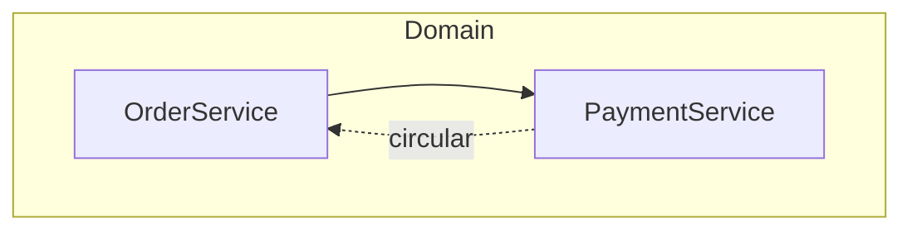

# Brooks Architecture Audit

Vendored from `brooks-audit/architecture-guide.md`. Analyze module and dependency structure for decay risks at the architectural level. Every finding follows `brooks-foundation.md` Iron Law.

**Monorepo:** treat each deployable service or library as a top-level module. Draw dependencies between services, not internal packages. Run Conway's Law at service ownership level; use module-level analysis inside a single service.

## Step 0: Gather Codebase Context

Before drawing the graph:

1. Glob top two directory levels to identify module boundaries.
2. Read the package manifest (`package.json`, `go.mod`, `Cargo.toml`, `pyproject.toml`) for language, framework, and declared dependencies.
3. Grep import edges (`import`, `from`, `require(`, `use`) - cap at 200 matches per language pass.
4. For directories with > 10 files, read `index.*`, `main.*`, or `__init__.*` for stated responsibility.

Stop when you can answer: top-level module names and count; which modules import which; highest fan-in or fan-out module.

If the project has > 100 top-level files or > 4 nesting levels, record sampled vs inferred areas in scope notes.

## Step 1: Module Dependency Graph (Mermaid)

Draw structure first without colors:

Rules:

1. Nodes = top-level directories or services, not individual files.
2. One `subgraph` per layer or top-level directory.
3. Solid arrows (`-->`) for dependencies; dotted (`-.->|circular|`) for cycles.
4. Cap at ~50 nodes; collapse low-risk leaves into parents.
5. Label fan-out > 5: `Module["Name (fan-out: 7)"]`.
6. Default `graph TD`; use `graph LR` only for clear left-to-right pipelines.
7. Apply `classDef` colors after Steps 2–4: `critical` `#ff6b6b`, `warning` `#ffd43b`, `clean` `#51cf66`.

## Step 2: Dependency Disorder

Scan first - highest architectural consequence.

- Circular dependencies
- Upward arrows (domain importing infrastructure)
- Stable widely-depended modules importing volatile modules
- Fan-out > 5
- No consistent layering rule

## Step 3: Domain Model Distortion

- Module names match business vocabulary
- No "services" layer holding all logic while domain objects are anemic data
- No billing logic in user module (bounded context violations)
- Anti-corruption layers at external system boundaries

## Step 4: Remaining Decay Risks

Apply `brooks-foundation.md` risks 3–6: duplication, accidental complexity, change propagation hotspots, cognitive overload.

## Step 5: Testability Seam Assessment

A seam alters behavior without editing source - interfaces, config points, injection boundaries.

Flag Warning when:

- Infrastructure (DB, FS, HTTP) cannot be replaced with a test double without editing the module under test.
- Seams collapsed (direct `new`, globals replaced injection).
- Legacy modules lack injection points.

Source: Feathers, Working Effectively with Legacy Code, Ch. 4.

## Step 6: Conway's Law Check

- Does module structure mirror team structure?
- Intentional design vs accidental coupling?
- Critical: cross-team ownership mismatch forces sync on every feature.
- Warning: theoretical mismatch not yet painful.
- Skip with "team structure unknown" when org data is unavailable.

## Output

Use the report envelope from `brooks-foundation.md`. Mode line: `Architecture Audit`. Mermaid graph first, then findings referencing node names.
